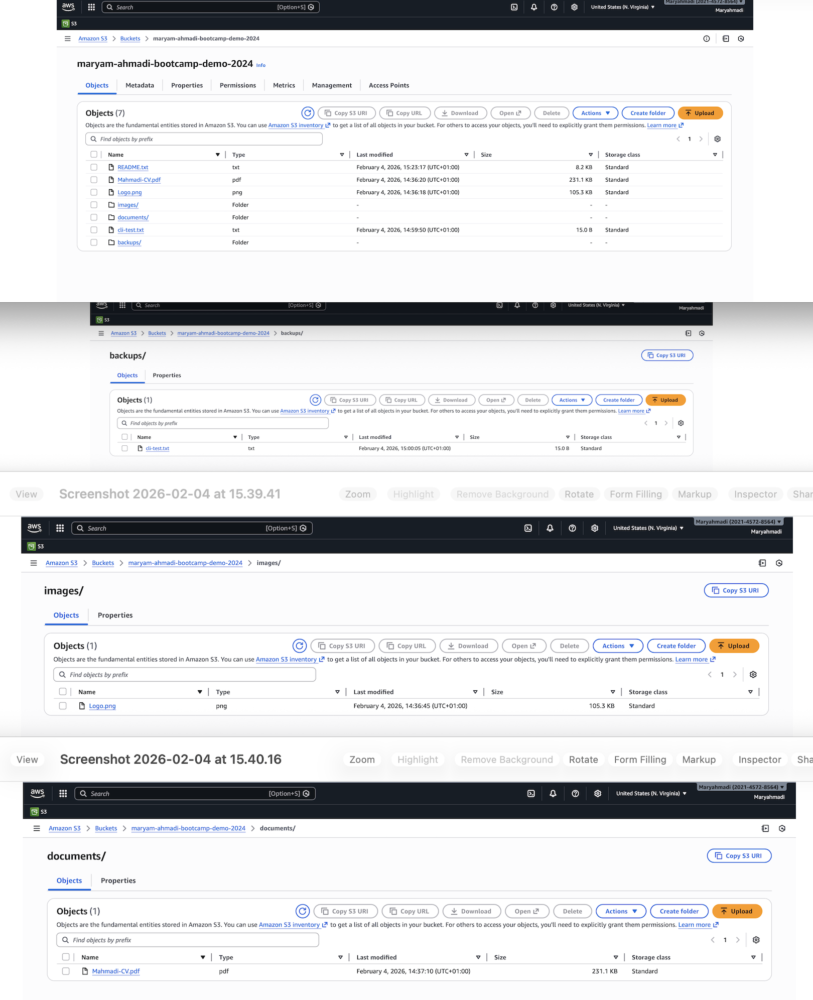
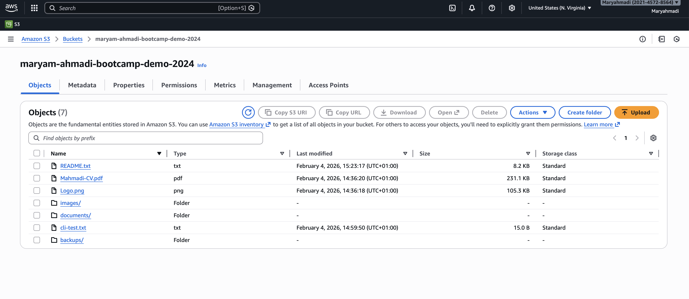
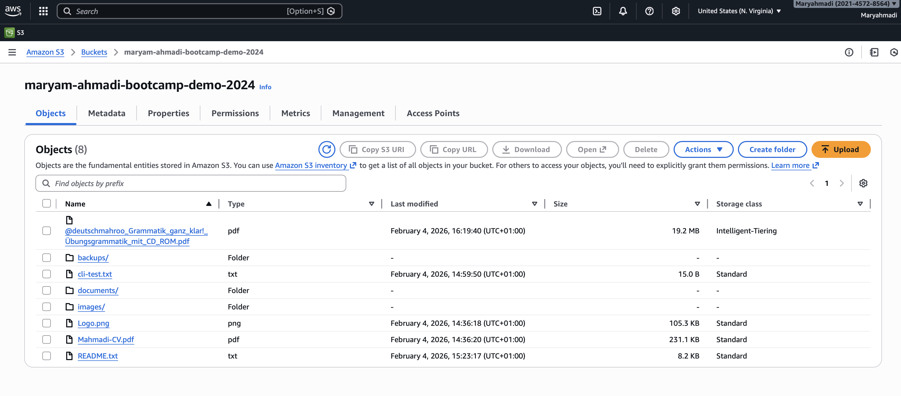
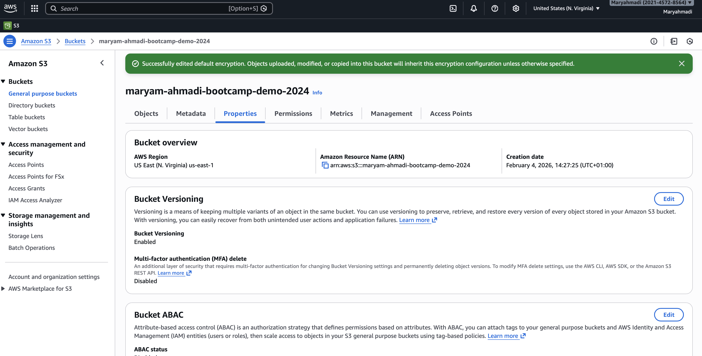
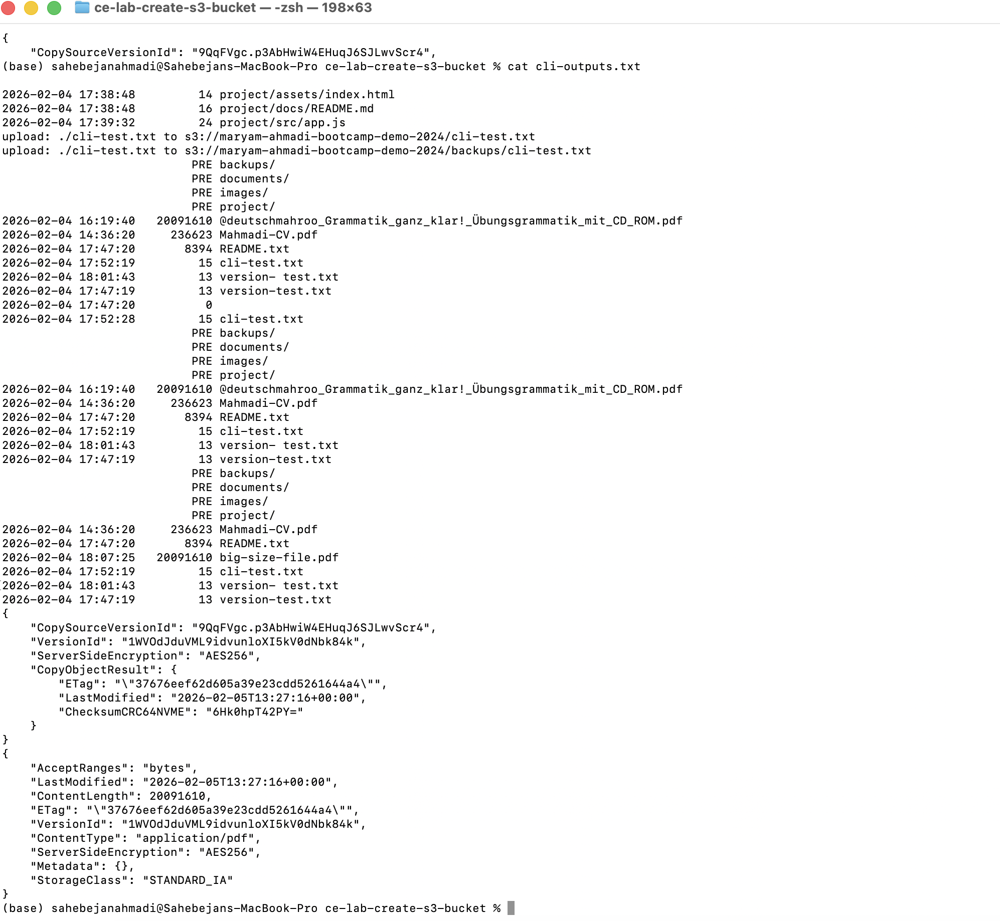
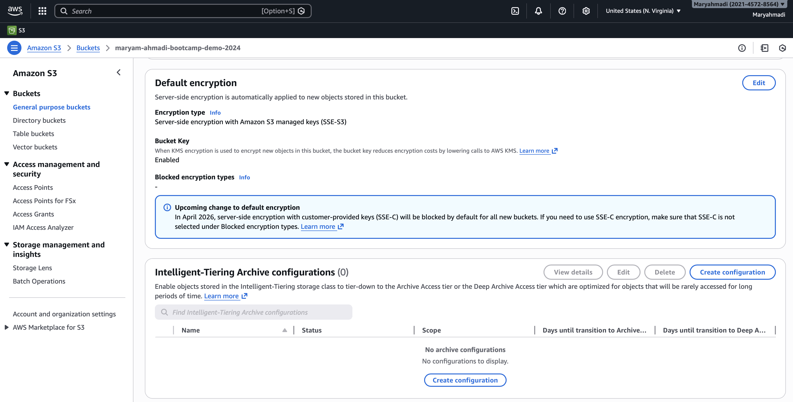
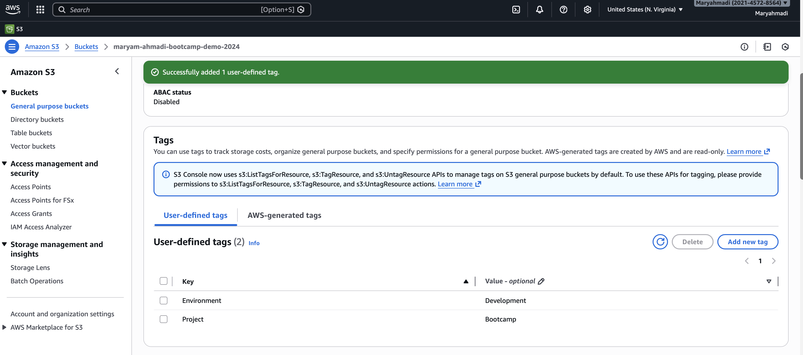
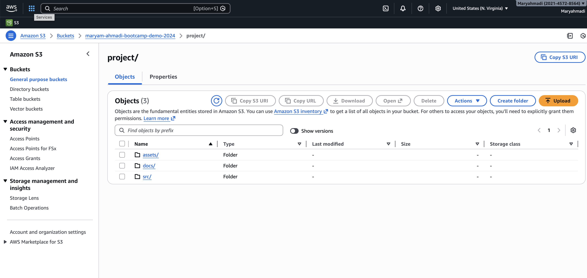
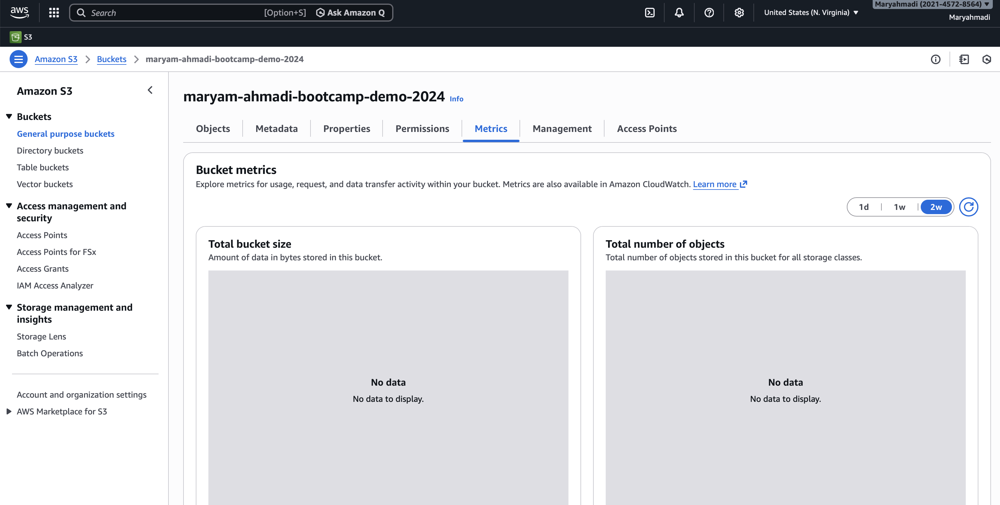

# Create S3 Bucket Lab - Solution

**Student Name:** Maryam Ahmadi  
**Date:** 11.02.2026
---

## Exercise 1: Bucket Creation

**Bucket Name:** [maryamahmadi-bootcamp-demo-2024]  
**Region:** [us-east-1]

**Block Public Access: Enabled (Default)

**Versioning: Disabled (initially)

**The bucket was successfully created via AWS Console and verified in the S3 dashboard.

---

## Exercise 2: Object Uploads

### Files Uploaded:
1. README.txt (Text file)
2. logo.png (Image file)
3. resume.pdf (Document file)
Files were organized into appropriate folders.

### Folder Structure:

**Folders Created:**
- images/
- documents/
- backups/

---

## Exercise 3: Storage Classes

**Storage Classes Used:**
- Standard: 3 objects
- Standard-IA: [1 objects
- Intelligent-Tiering: 1 objects

Actions Performed:

Uploaded a file using Standard-IA

Modified existing object to Intelligent-Tiering

This demonstrates cost optimization strategies for infrequently accessed data.
---

## Exercise 4: Bucket Features

### Versioning:

**Number of versions created:** 4

Versioning protects against accidental deletion and overwrites.

### Encryption:

**Encryption type:** SSE-S3

### Tags:

**Tags Added:**
- Environment: Development
- Project: Bootcamp

---

## Exercise 5: Download/Delete

**Operations Completed:**
-  Downloaded object via console
-  Downloaded object via CLI
-  Deleted object via console
-  Deleted object via CLI

---

## Exercise 6: Sync Operations

**Files Synced:** 3  
**Total Size:** 3.8

---

## Exercise 7: Metrics

**Bucket Statistics:**
- Total objects: 2
- Total size: 7.4 GB
- Storage class distribution: Metrics help monitor storage growth and cost.

---

## Bonus Challenges

### Lifecycle Policy:

**Policy Rules:**
-  Transition to Standard-IA: 30 days
-  Transition to Glacier: 90 days
-  Delete: 365 days

---

## CLI Outputs

See `cli-outputs.txt` for all command outputs.

---

## Reflection

**What did you learn about S3?**

I learned that Amazon S3 is a highly durable and scalable object storage service. It allows organizing data in buckets and folders (prefixes), supports versioning, encryption, tagging, and offers multiple storage classes for cost optimization. Using the AWS Console and CLI, I can upload, download, sync, and manage objects efficiently while implementing best practices for security and data management.

**When would you use different storage classes?**

Different storage classes are used based on access patterns and cost requirements:

Standard: For frequently accessed data that needs low latency.

Standard-IA (Infrequent Access): For data accessed less often but still requires quick retrieval.

Intelligent-Tiering: Automatically moves objects between frequent and infrequent access tiers based on usage patterns, ideal for unpredictable workloads.

Glacier / Deep Archive: For long-term archival data with rare access needs, minimizing storage cost.

---

## Checklist

-  Bucket created
-  Objects uploaded (console and CLI)
-  Folders created
-  Storage classes configured
-  Versioning enabled and tested
-  Encryption enabled
-  Tags added
-  Sync completed
-  All screenshots captured
-  Bucket cleaned up (deleted)

**Completed By:** [Your Name]
